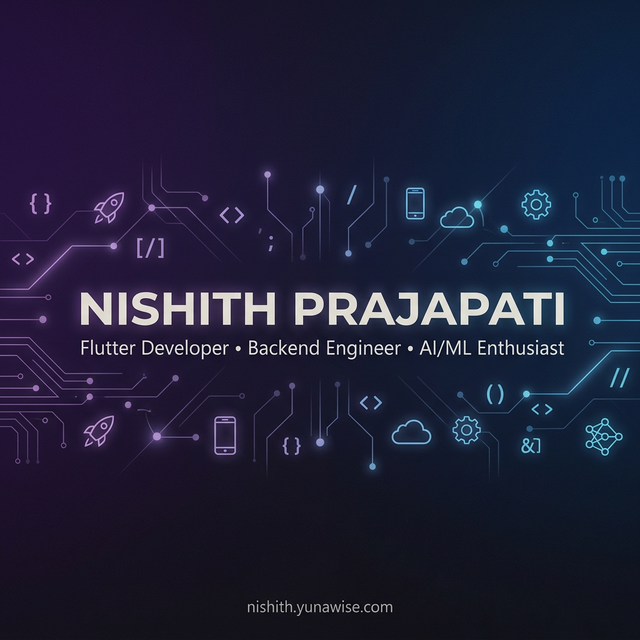

  

  

  
  
  

---

## 👋 About Me

I'm **Nishith Prajapati** — a Flutter Specialist and Backend Engineer crafting high-performance, beautifully robust mobile applications and scalable server-side systems. From **fantasy sports platforms** to **AI-powered fitness companions**, I turn complex ideas into pixel-perfect, production-ready products.

- 🔭 **Currently Working On:** Cross-platform mobile solutions & backend microservices  
- 🌱 **Currently Learning:** Advanced MLOps, on-device AI inference  
- 💬 **Ask Me About:** Flutter architecture, FastAPI, mobile performance optimization  
- 🏠 **Based In:** India (Remote-first)  
- ⚡ **Fun Fact:** I believe great software is indistinguishable from magic

---

## 🛠️ Tech Stack

<b>Languages</b>

 

  
  
  
  
  
  

<b>Frameworks & Libraries</b>

 

  
  
  
  
  
  
  

<b>Tools & Platforms</b>

 

  
  
  
  
  
  
  
  
  
  

---

## 📊 GitHub Stats

  
  

  

---

## 🏆 GitHub Trophies

  

---

## 🐍 Contribution Snake

  <picture>
    <source media="(prefers-color-scheme: dark)" srcset="https://raw.githubusercontent.com/Nishith312/Nishith312/output/github-snake-dark.svg" />
    <source media="(prefers-color-scheme: light)" srcset="https://raw.githubusercontent.com/Nishith312/Nishith312/output/github-snake.svg" />
    
  </picture>

---

## 📈 Contribution Graph

  

---

## 🚀 Featured Projects

  
  
  
  

---

## 🤝 Connect with Me

  
  
  
  

---

  

  <i>✨ "Great software is indistinguishable from magic." ✨</i>
    
  <b>If you find my work interesting, consider giving a ⭐!</b>

